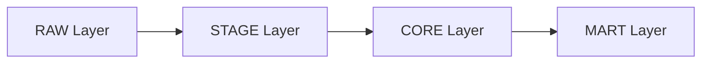
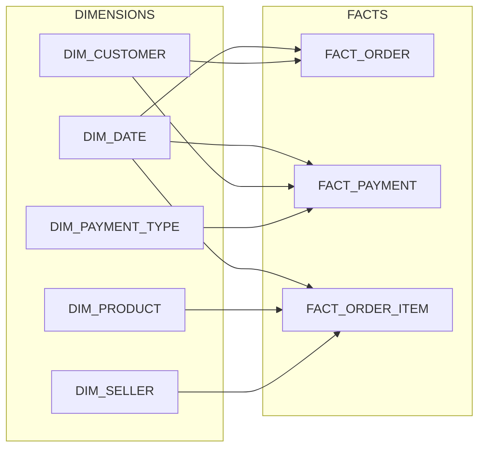
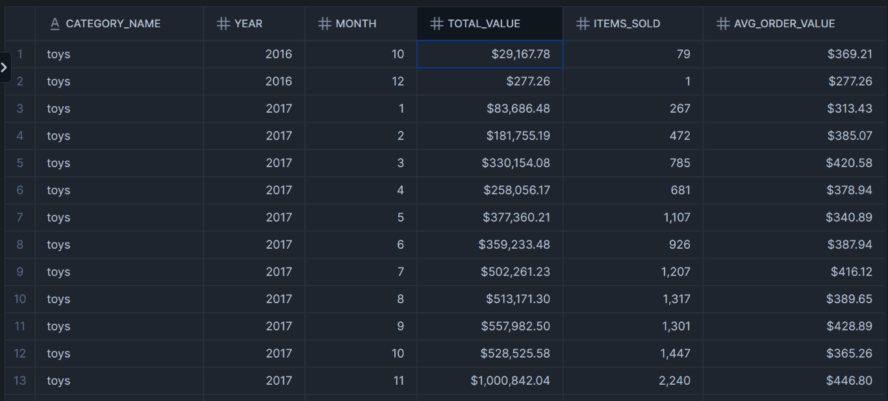
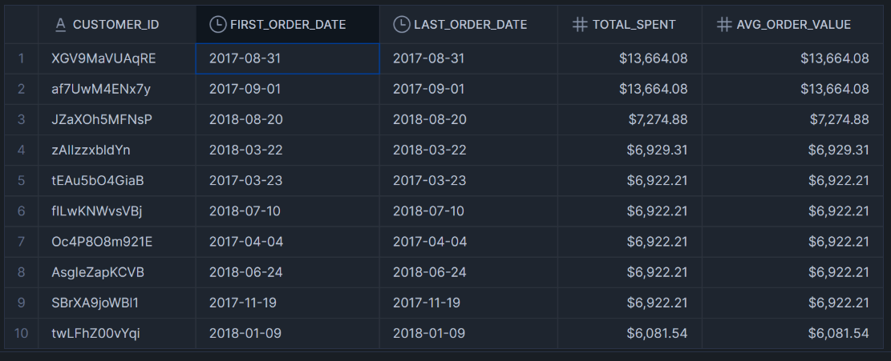
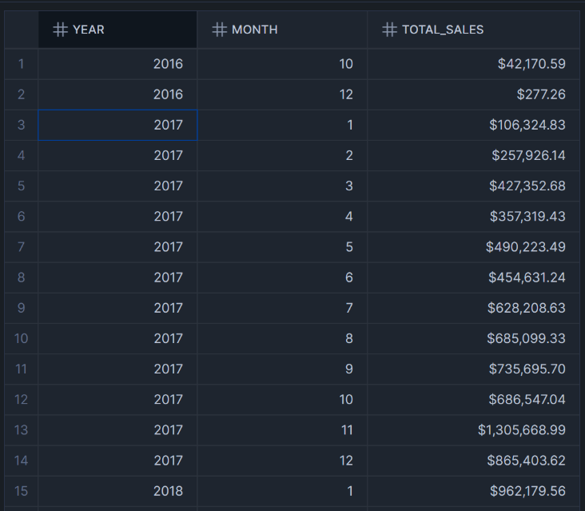
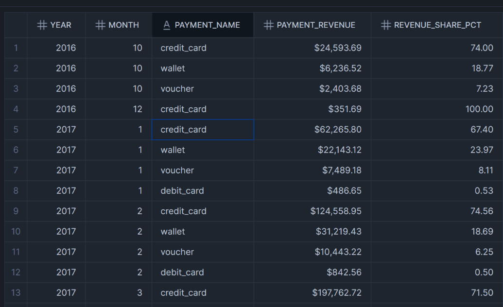

# 📌 Snowflake E-commerce Data Warehouse — Multi-Table ETL & Analytics

A full **data warehouse project** built on Snowflake that demonstrates modern ETL/ELT practices, dimensional modeling, and business-ready analytics.  

This project takes raw CSV e-commerce data and transforms it into a layered warehouse with **facts, dimensions, marts, KPIs, and visual query results** — all retrievable in Snowsight.

---

# 📑 Table of Contents
- [Tech Stack](#-tech-stack)
- [Project Overview](#-project-overview)
- [Dataset](#-dataset)
- [Data Engineering Approach](#-data-engineering-approach)
- [How to Run](#-how-to-run)
- [Example Queries / Output](#-example-queries--output)
- [Results](#-results)
- [Future Improvements](#-future-improvements)
- [License](#-license)
- [Contributing](#-contributing)
- [Author](#-author)

---

# 🛠 Tech Stack

- **Data Warehouse:** Snowflake (Snowsight UI)
- **Languages and Tools**: SQL (Snowflake SQL), Git & Github
- **Documentation:**: Markdown, Mermaid diagrams for data flow visualization

---
# 🎯 Project Overview

**Problem:**  
E-commerce businesses collect data across multiple touchpoints (customers, orders, products, payments), but raw CSVs are difficult to query and analyze directly. Without integration, it’s nearly impossible to calculate key business metrics like total sales, top sellers, or payment adoption trends.

**Solution:**  
This project builds a **layered Snowflake data warehouse** to clean, standardize, and model the raw e-commerce dataset into a star schema. From there, it introduces business-facing marts and KPIs for fast, reliable insights.  

- **RAW Layer:** Exact CSV replicas for traceability.  
- **STAGE Layer:** Cleaned and standardized views.  
- **CORE Layer:** Dimensional star schema (facts + dims).  
- **MART Layer:** Aggregated, analyst-friendly views (sales, payments, revenue trends, etc.).  

**Outcome:**  
A scalable, production-style warehouse that supports BI use cases. The repo includes queries, screenshots of Snowsight results, and diagrams that demonstrate en

<p align="center">
  
</p>

> Example KPI: **Top Sellers By Revenue** — directly powered by the CORE facts and MART views.

---
# 📂 Dataset

> Although the dataset includes training and test splits for ML purposes, this project focuses solely on the test datasets to build a realistic warehouse and showcase data engineering skills.

- **Source:** [E-commerce Order & Supply Chain Dataset from Kaggle](https://www.kaggle.com/datasets/bytadit/ecommerce-order-dataset)
- CSV Files Used (test datasets only):
  - df_Customers.csv
  - df_Orders.csv
  - df_OrderItems.csv
  - df_Products.csv
  - df_Payments.csv
- Size: ~38k rows per table
- License: [CC BY-NC-SA 4.0](https://creativecommons.org/licenses/by-nc-sa/4.0/)

> These separate CSVs allow relational analysis and realistic warehouse modeling.
---
# 🧰 Data Engineering Approach

This project follows a **layered warehouse design** (RAW → STAGE → CORE → MART) to ensure traceability, consistency, and business-ready analytics.

- **Tables Ingested:** Customers, Orders, Order_Items, Products, Payments (Loaded directly from Kaggle CSVs into the RAW layer)
- **Key Transformations:**
  - Normalized data types and standardized text fields
  - Created primary and foreign keys (`customer_id`, `order_id`, `product_id`)
  - Built surrogate keys for dimensions in the CORE layer
  - Deduplicated records and handled missing values
  - Introduced derived attributes (`order_date`, `volume_cm3`, `total_value`)
- **Analysis Examples:**
  - Total sales per product and category
  - Customer purchase frequency and trends
  - Monthly order volume and revenue
  - Payment method breakdown

---
## High Level Flow

The data pipeline follows a layered architecture:



---
## Core Star Schema

At the CORE layer, data is modeled into facts and dimensions to support business-ready analytics:



---
# 💻 How to Run

This project is designed to run entirely in **Snowflake** using the provided SQL scripts.

### 1. Clone the Repository
```bash
git clone https://github.com/yourusername/snowflake-ecommerce.git
cd snowflake-ecommerce
```

### 2. Set up Snowflake Environment
Log into your Snowflake account and create a worksheet for running the SQL scripts.

### 3. Run the SQL Scripts in Order

Execute the SQL files sequentially from `/sql`:

1. **01_wh_db_schemas.sql** -> Creates the warehouse, database, and schemas
2. **02_Raw_Tables.sql** -> Defines RAW tables matching source CSVs
3. **03_Stage_FileFormat_Stage.sql** -> Creates file format and staging area
4. **04_copy_into_raw.sql** -> Loads CSVs into RAW tables
5. **05_stage_to_core.sql** -> Standardizes and cleans staged data
6. **06_dim_tables.sql** -> Builds dimension tables (customer, product, etc.)
7. **07_fact_tables.sql** -> Builds fact tables (orders, items, payments)
8. **08_test_joins.sql** -> Validates schema joins and relationships
9. **09_core_to_mart.sql** -> Creates business-facing MART views
10. **10_example_queries.sql** -> Example queries for exploration
11. **11_kpis.sql** -> Predefined KPI queries (sales, growth, top sellers, etc.)

### 4. Explore Results

- Query the MART layer or run provided examples.
- View `/docs/` for screenshots and architecture diagrams.
- KPIs include:
  - Total sales by month
  - Month-over-Month growth
  - Top sellers by revenue
  - Payment method usage trends

---
# 📊 Example Queries / Output

Below are some representative queries and outputs from the MART and KPI layers.  
(All screenshots are from **Snowsight UI**. Full gallery available in `/docs/`.)  

### Sales by Product Category


### Top 10 Customers by Total Amount Spent


### Monthly Order Trends


### Payment Method Distribution


---
# 📈 Results

- ✅ Loaded multi-table **e-commerce dataset** into Snowflake  
- ✅ Built **layered data architecture** (RAW → STAGE → CORE → MART)  
- ✅ Demonstrated **SQL transformations, joins, and aggregations**  
- ✅ Created **star-schema facts/dims** for business-ready analytics  
- ✅ Produced **MART views and KPIs** for reporting & insights  
- ✅ Added **Snowsight query screenshots** for traceability and reproducibility  

---
# 🔮 Future Improvements

While this project demonstrates a full end-to-end Snowflake data warehouse on an e-commerce dataset, there are several areas for growth:

- **BI Dashboards:** Integrate with tools like Power BI, Tableau, or Looker for interactive visualizations.  
- **Automated ETL:** Orchestrate the SQL pipeline using Airflow, dbt, or Snowflake Tasks/Streams for scheduled updates.  
- **Additional Data Sources:** Extend with new datasets such as inventory, shipping, or customer support to enrich analysis.  
- **Performance Optimization:** Apply clustering, materialized views, and query tuning for large-scale data scenarios.  
- **CI/CD & Testing:** Add automated testing of SQL transformations and implement CI/CD pipelines for production-ready workflows. 

---
# 📜 License

This project is licensed under the MIT License.

---
# 🤝 Contributing
Contributions, issues, and feature requests are welcome! Feel free to open a PR or issue.

---
# 🙋‍♀️ Author

Kathryn Jumara
- LinkedIn: https://www.linkedin.com/in/kathrynjumara/
- Portfolio: [Your Portfolio URL]
- Email: kjumara@yahoo.com
