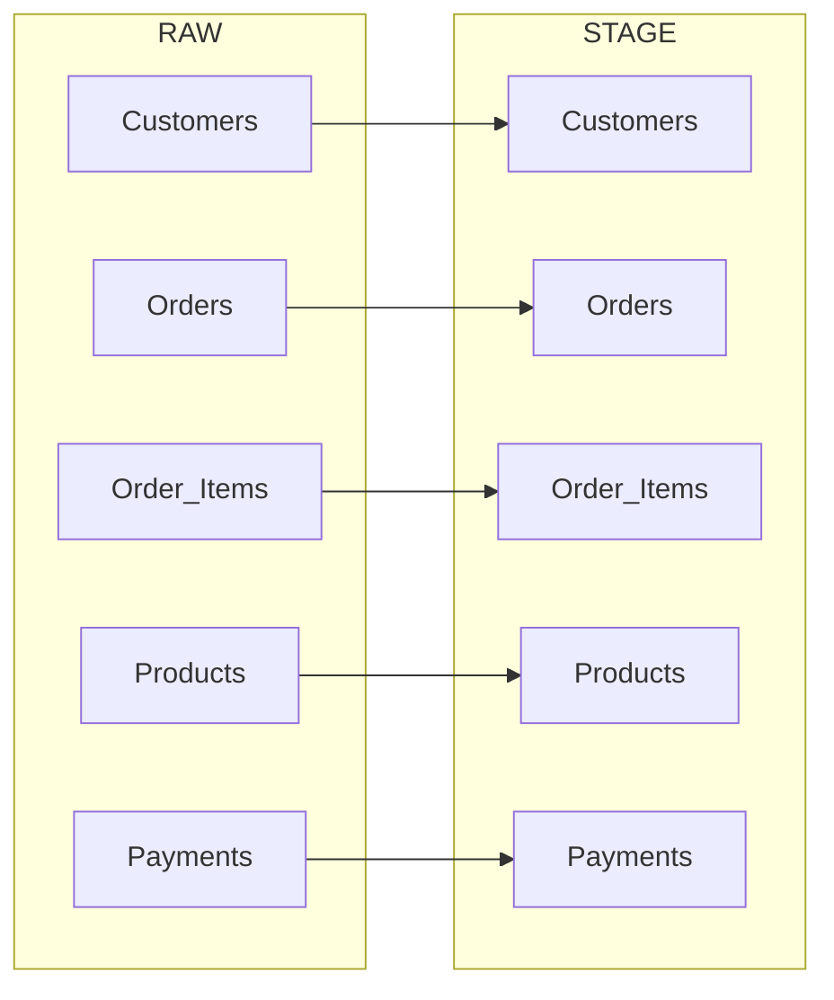
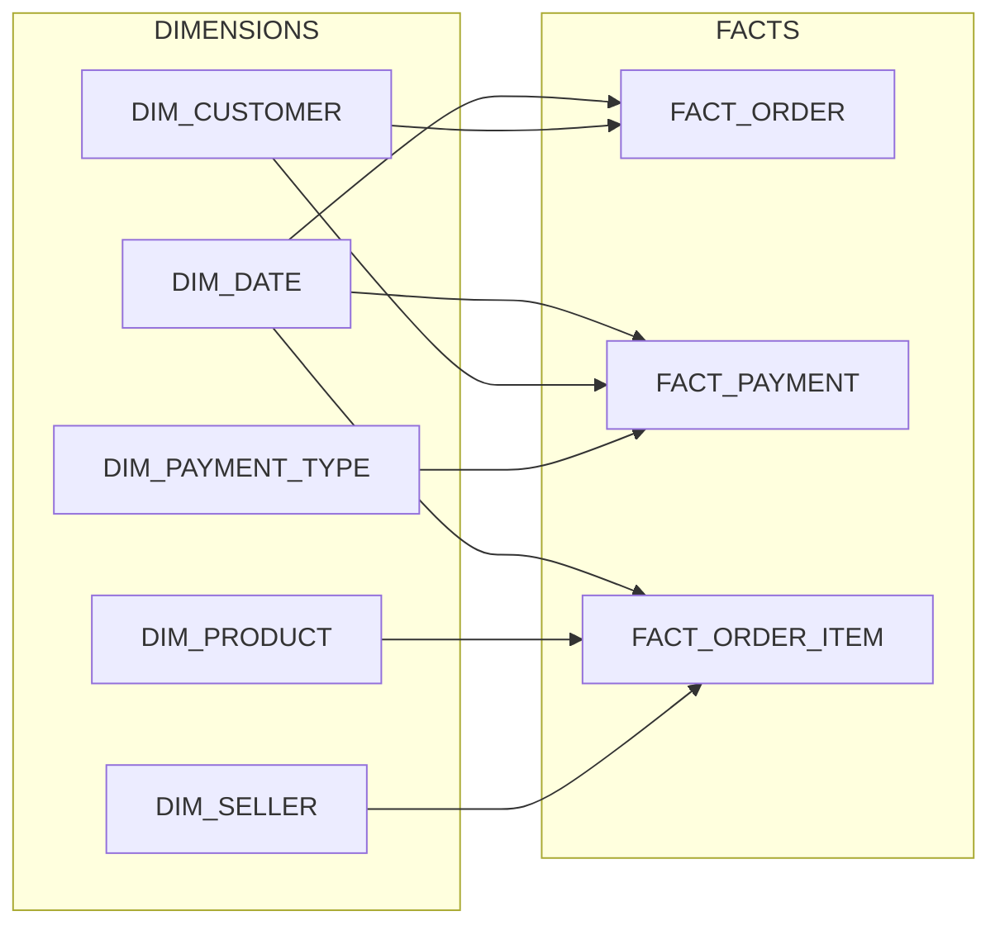
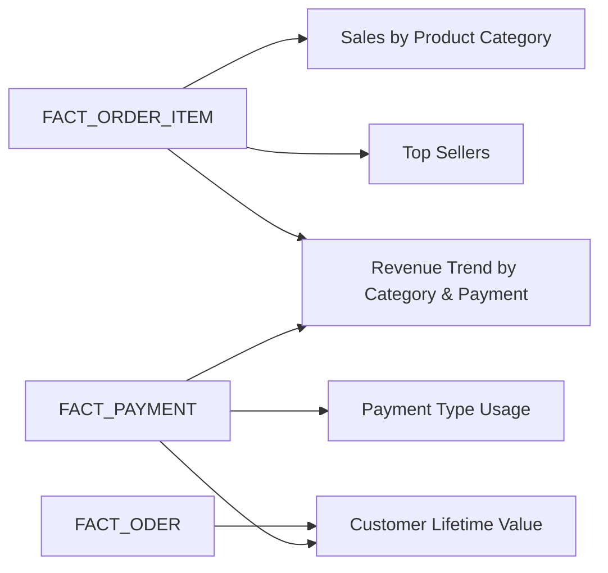

# 🏗️ Data Architecture

This project follows a **layered data warehouse design** in Snowflake to ensure clean, reliable, and business-ready data.  

---
## RAW Layer
The RAW layer stores data exactly as received from the Kaggle e-commerce dataset. 

Each table corresponds 1:1 to a source CSV file, with no transformations applied.

- **CUSTOMERS**   → from `df_Customers.csv`,  customer profile and location details.  
- **ORDERS**      → from `df_Orders.csv`,     high-level order information (ID, customer, timestamps).  
- **ORDER_ITEMS** → from `df_OrderItems.csv`, line-level order details including product, seller, and charges.  
- **PRODUCTS**    → from `df_Products.csv`,   product catalog with dimensions and category.  
- **PAYMENTS**    → from `df_Payments.csv`,   order payment details including type, installments, and value.  

> This layer provides an immutable copy of the source data for traceability and reproducibility.
---
## STAGE Layer - Views
The STAGE layer cleans and standardizes data from the RAW layer while keeping a 1:1 mapping to source entities.  

This layer ensures consistency, prepares numeric/text fields for downstream modeling, and introduces basic derived attributes.

- **CUSTOMERS** → Trimmed IDs and city names, standardized casing, preserved `zip_code_prefix` as STRING.  
- **ORDERS** → Cleaned IDs, converted timestamps, and added `order_date` for easier filtering.  
- **ORDER_ITEMS** → Standardized IDs, cast numeric values, renamed `shipping_charges` → `freight_value`, and added `total_value` (price + freight).  
- **PRODUCTS** → Standardized category names, cast dimensions to numeric, and introduced `volume_cm3` (length * width * height).  
- **PAYMENTS** → Cleaned IDs, normalized `payment_type` to lowercase, and cast numeric fields.  

> This layer acts as a **clean but lightly transformed** foundation for business-ready transformations in the CORE layer.

---
## CORE Layer — Dim & Fact Tables
This layer transformed staged data into **deduplicated dimensions and fact tables** using a **star schema** for business-ready analytics.

### Dim Tables
- **DIM_CUSTOMER** → Deduplicated customer records, surrogate key added for joining facts.
- **DIM_PRODUCT** → Cleaned product attributes, numeric dimensions, calculated `volume_cm3`, surrogate key added. 
- **DIM_SELLER** → Deduplicated seller records (one row per seller), surrogate key added. 
- **DIM_DATE** → Standard date dimension for filtering and aggregations. 
- **DIM_PAYMENT_TYPE** → Normalized payment types, surrogate key added.

### Fact Tables
- **FACT_ORDER** → One row per order, links to customer and order date for traceability.
- **FACT_ORDER_ITEM** → One row per item in an order, links to products and sellers, includes price, freight, and total value.
- **FACT_PAYMENT** → One row per payment, links to orders and payment type, includes installments and payment value.

> This layer provides a business-ready model that is easy to query, supports analytics, and preserves links to original staged data.
---
## MART Layer — Business-Facing Views

The MART layer provides **aggregated, business-ready views** built from the CORE facts and dimensions.  
These views are **denormalized and pre-aggregated** for common analytical use cases, enabling fast queries for KPIs and dashboards.  

### MART Views
- **SALES_BY_PRODUCT_CATEGORY** → Summarizes sales by `product category x year x month`.  
  Includes: `total_value`, `items_sold`, `avg_order_value`.  

- **TOP_SELLERS** → Ranks sellers by revenue for each `year x month`.  
  Includes: `total_revenue`, `items_sold`, `avg_item_value`, and revenue-based ranking.  

- **PAYMENT_TYPE_USAGE** → Tracks adoption of payment methods by `year x month`.  
  Includes: `num_payments`, `num_orders`, `total_payment_value`, `avg_installments`, and `% of month’s value`.  

- **CUSTOMER_LIFETIME_VALUE** → Customer-level spending summary.  
  Includes: `first_order_date`, `last_order_date`, `total_spent`, `avg_order_value`.  
  > Note: In this dataset each customer has only one order, so results are simplified.  

- **REVENUE_TREND_BY_CATEGORY_AND_PAYMENT** → Cross-analyzes `product category x payment type x year x month`.  
  Includes: `total_revenue`, `items_sold`.  

> This layer represents the **consumption zone** for BI tools and reporting. It surfaces the most important KPIs in a way that is easy to use for non-technical analysts.

---
## Data Flow Diagram

The following Mermaid diagrams shows how data flows from **RAW → STAGE → CORE → MART**:  

### Diagram A — High-Level Flow

Layers: **RAW -> STAGE -> CORE -> MART**

### Diagram B — Raw to Stage

Layers: **RAW -> STAGE**

### Diagram C — Core Detail (Facts + Dims)

Split dims vs facts, show relationships

### Diagram D — Mart Outputs

Fact -> Mart Connections

---
## Benefits of This Approach
- **Traceability:** Can always trace metrics back to raw source data.  
- **Separation of Concerns:** Each layer has a clear responsibility (landing, cleaning, modeling, reporting).  
- **Scalability:** Easy to extend by adding new sources or marts.  
- **Professional Standard:** Mirrors common warehouse design patterns (Kimball-style).
---
